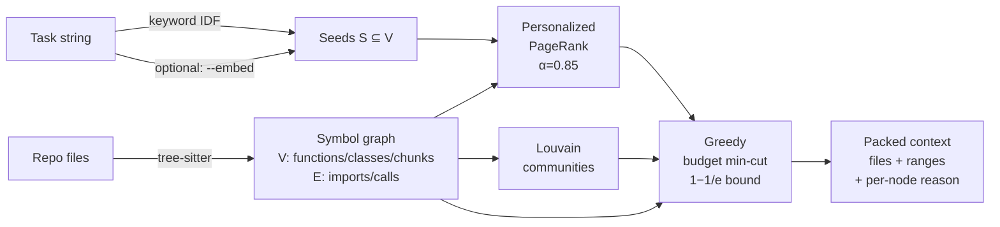

<div align="center">

# `mincut-context`

**Token-minimal context selection for AI coding agents.**

A symbol graph of your repo + personalized PageRank + budget-constrained min-cut
— picks the smallest provably-relevant context for any task.

[](https://www.npmjs.com/package/mincut-context)
[](https://www.npmjs.com/package/mincut-context)
[](https://bundlephobia.com/package/mincut-context)
[](./src)
[](./package.json)
[](https://github.com/dhrupo/mincut-context/actions/workflows/ci.yml)
[](./tests)
[](./eval/CROSS-REPO-RESULTS.md)
[](./LICENSE)

</div>

<p align="center"></p>

<div align="center">

```bash
npm install -g mincut-context     #   global CLI: mcx
npx mincut-context pack "fix the login validation bug" --budget 4000
```

</div>

> One sentence: an agent that opens `mincut-context` first gets the minimum cohesive *region* of code its task depends on — not a grep hit, not a whole file, not the whole repo.

> **What's new in v1.7** — proven on 3 real codebases. **28 labeled tasks**, full report at [`eval/CROSS-REPO-RESULTS.md`](./eval/CROSS-REPO-RESULTS.md). Aggregate: mincut catches **83% of correct files vs grep's 42%**. Plus 88.6% test coverage with CI gate. See [CHANGELOG.md](./CHANGELOG.md).

---

<details>
<summary><b>Table of contents</b></summary>

- [Why](#why)
- [The idea](#the-idea)
- [Install](#install)
- [Quick start](#quick-start)
- [Use it three ways](#use-it-three-ways) — [MCP server](#1-as-an-mcp-server--recommended-for-agents) · [CLI](#2-as-a-cli) · [Library](#3-as-a-library)
- [How it works](#how-it-works)
- [Real-world examples](#real-world-examples)
- [Languages](#languages)
- [CLI reference](#cli-reference)
- [How it compares](#how-it-compares)
- [Roadmap](#roadmap)
- [Tradeoffs (honest)](#tradeoffs-honest)
- [Contributing](#contributing)
- [License](#license)

</details>

---

## Why

AI coding agents waste your context window. Two failure modes:

| | What it does | Cost |
|---|---|---|
| **Over-stuff** | Dumps whole files / all of `src/` | Burns tokens, drowns the model, hurts answer quality |
| **Under-stuff** | Grep a string, return 3 lines | Misses callers, dependents, tests — model hallucinates |

Neither uses what the code actually *is*: a graph.

## The idea

Treat context selection as a graph problem.

> Given a symbol graph `G = (V, E, w)` where `V` are code units (functions, classes), `E` are dependency edges (imports, calls, references), `w(v)` is the token cost of `v`, a token budget `B`, and seeds `S ⊆ V` derived from the task:
>
> Find `T ⊇ S` with `Σ tokens(T) ≤ B` minimizing the **boundary cut cost** `cut(T, V\T) = Σ w(e)` for edges crossing the boundary.

In plain English: pick a connected, low-token region that has few "loose ends" pointing outside it. The inside of the cut is what the agent needs to see; the outside is safely ignorable.

The objective is **submodular**, so a greedy algorithm gives a `(1 - 1/e) ≈ 0.63` approximation guarantee. Full math in [`SPEC.md`](./SPEC.md).

---

## Install

```bash
# global CLI (recommended)
npm install -g mincut-context

# or per-project
npm install --save-dev mincut-context

# or one-shot, no install
npx mincut-context pack "your task" --budget 4000
```

Requires **Node ≥ 18.17**. TypeScript types ship with the package.

Optional peer dependencies:

| When you want | Install |
|---|---|
| `--lsp` type-aware call resolution | `npm i -g typescript-language-server` |
| `--embed` semantic seeding | (auto — `@xenova/transformers` ships in the package) |

## Quick start

```bash
# 0. (One-time) sanity check the environment
mcx doctor

# 1. Index any repo once (warms the gzipped cache)
mcx index . --cache

# 2. Ask for context for a task
mcx pack "fix the login validation bug" --budget 4000 --cache

# 3. Pipe straight into your agent
mcx pack "..." --format markdown > context.md
mcx pack "..." --format json | jq '.files[].path'

# 4. Stay-running mode during dev
mcx watch "fix the login bug" --budget 4000 --cache
```

---

## Use it three ways

### 1. As an MCP server — recommended for agents

Drop into Claude Code, Codex, Cursor, or any MCP-aware client:

```json
{
  "mcpServers": {
    "mincut-context": {
      "command": "npx",
      "args": ["-y", "mincut-context", "mcp"]
    }
  }
}
```

Your agent now has three tools:

| Tool | Description |
|---|---|
| `pack_context(task, repo, budget?, cache?, cacheDir?, communityBoost?)` | Get a token-minimal, structurally-relevant context window |
| `expand_node(node, depth?)` | Pull more around a specific symbol |
| `explain_selection()` | The rationale for the last selection |
| `find_callers(node)` | Symbols that call this one (incoming edges) |
| `find_callees(node)` | Symbols this one calls (outgoing edges) |
| `search_symbols(query, limit?)` | Substring search across the cached graph |

### 2. As a CLI

```bash
mcx pack "your task description" --budget 4000             # plain output
mcx pack "..." --format tree                               # directory-grouped tree
mcx pack "..." --format json | jq                          # pipe-friendly
mcx pack "..." --format markdown > context.md              # ready-to-paste
mcx pack "..." --interactive                               # Ink TUI (vim keys + preview)
mcx pack "..." --embed                                     # semantic seeding
mcx pack "..." --cache                                     # persistent parse cache (5× speedup)
mcx pack "..." --parallel 4                                # worker-thread parser pool
mcx pack "..." --chunk                                     # split huge functions into sub-symbols
mcx pack "..." --lsp                                       # type-aware call resolution (TS)
mcx pack "..." --verbose                                   # algorithm trace
mcx watch "..." --debounce 300                             # re-pack on file change
mcx index . --cache                                        # warm the parse cache
mcx doctor                                                 # environment self-check
mcx mcp                                                    # run as MCP server
```

### 3. As a library

```ts
import { pack } from 'mincut-context';

const result = await pack({
  task: 'fix the login validation bug',
  repo: process.cwd(),
  budget: 4000,
  cache: true,            // persistent gzipped parse cache
  communityBoost: 0.5,    // Louvain intra-cluster bias
  parallel: 4,            // worker-thread parsing
  chunk: { enabled: true, maxTokens: 400 },  // sub-symbol chunking
  trimScoreRatio: 0.02,   // drop tail files below 2% of top score
});

for (const f of result.files) {
  console.log(f.path, f.score.toFixed(3), f.tokens, '·', f.reasons[0]);
}
// → src/auth/login.ts        0.541  612 · seed — matched directly by task
// → src/auth/session.ts      0.408  483 · attached (60%)
```

Full TypeScript types — `pack`, `indexRepo`, `indexRepoAsync`, `SymbolGraph`, `personalizedPageRank`, `greedySelect`, `detectCommunities` are all exported.

---

## How it works



The five steps in pseudocode:

```text
pack(task, repo, budget):
  1. graph  = index(repo)                       # tree-sitter → symbol+edge graph
                                                # optionally chunked into sub-symbols
                                                # optionally refined by LSP
  2. seeds  = scoreSeeds(task, graph)           # keyword IDF (+ embeddings if --embed)
  3. ranks  = personalizedPageRank(graph, seeds, α=0.85)
  4. comm   = louvainCommunities(graph)         # for intra-cluster boost
  5. T      = greedyMinCut(graph, ranks, seeds, budget, comm):
       T ← seeds
       while Σ tokens(T) < B:
         v* ← argmax_{v ∉ T, attach(v,T) > 0}
                 rank(v) · attach(v,T) · communityBonus(v) / tokens(v)
         T ← T ∪ {v*}
  6. ranges = collapseToFileRanges(T)
  7. return { files: ranges, tokens, graph: {...}, explain, trace? }
```

The "no isolated nodes" rule (`attach(v, T) > 0`) is what gives you the *cohesion guarantee* — adding a fully-detached node would strictly increase the cut without benefit, so the greedy refuses. That's why an "auth" task never drags in unrelated UI files even when budget permits.

### Semantic embeddings (optional)

Pure keyword matching misses semantic neighbors:

```bash
$ mcx pack "ranking and centrality algorithm" --repo .
no context selected — no symbols matched

$ mcx pack "ranking and centrality algorithm" --repo . --embed --embed-weight 0.8
→ src/core/graph.ts         0.638  205 tok
→ src/core/pagerank.ts      0.282  725 tok   ← the actual algorithm!
→ src/seeds/keyword.ts      0.080   18 tok
```

"Centrality" never appears in any symbol name — only embeddings could find this.
Uses [`@xenova/transformers`](https://github.com/xenova/transformers.js) (Transformers.js + ONNX). Fully local, ~22 MB model download on first use.

### LSP-backed call resolution (optional)

Syntactic name matching can be ambiguous when two files export functions with the same name. `--lsp` asks `typescript-language-server` for the authoritative answer and adds higher-weight edges where it disagrees:

```bash
npm i -g typescript-language-server     # one-time
mcx pack "your task" --repo . --lsp
```

If the LSP fails or the binary is missing, mincut falls back silently to syntactic edges.

---

## Real-world examples

**On the [Fluent Player](https://fluentplayer.com) free repo** (225 files, 845 symbols, 2,726 edges):

```bash
$ mcx pack "analytics visit tracking" --budget 3000 --exclude tests/**
→ resources/js/utils/googleAnalytics.js   0.553   556 tok   ← seed
→ resources/js/utils/ajax.js              0.174   254 tok
→ resources/js/AnalyticsTracker.js        0.162  1477 tok
→ resources/admin/utils/Notify.js         0.077   104 tok
→ [5 tail files pulled in by graph attachment]
selected 20 / 845 symbols (2.4% of codebase)
```

**On the [Fluent Forms](https://fluentforms.com) plugin** (809 files of mixed PHP + Vue + JS, 4,333 symbols, 3,776 edges):

```bash
$ mcx pack "payment stripe processor" --budget 3000 --cache --community-boost 0.8
→ app/Modules/Payments/PaymentMethods/Stripe/StripeProcessor.php       1955 tok  ← seed
→ app/Modules/Payments/PaymentMethods/Stripe/StripeHandler.php         246 tok
→ app/Modules/Payments/AjaxEndpoints.php                               152 tok
→ app/Modules/Payments/PaymentMethods/Stripe/API/RequestProcessor.php  159 tok
→ app/Modules/Payments/PaymentMethods/Stripe/API/Plan.php              331 tok
→ app/Modules/Payments/PaymentMethods/Stripe/API/ApiRequest.php         26 tok
```

That's exactly the Stripe cluster — no UI noise, no test fixtures, no unrelated modules.

---

## Languages

| Language | Status | Notes |
|---|---|---|
| TypeScript / JavaScript | ✅ v1.0 | `.ts .tsx .js .jsx .mjs .cjs` |
| Python | ✅ v1.0 | `.py .pyi`, relative imports, decorators, methods |
| PHP | ✅ v1.2 | `.php`, namespaces, traits, `use` (incl. grouped + aliased), `$this->`, `Foo::bar()` |
| Vue SFC | ✅ v1.2 | `.vue`, `<script>` Options API + `<script setup>` Composition API, `lang="ts"` honored |
| Rust, Go, Svelte, … | community welcome | tree-sitter grammar + symbol queries |

**Sub-symbol chunking** is supported on all 4 languages above as of v1.4 (TS/JS/Vue + Python + PHP).

**LSP-backed call resolution** currently covers TypeScript / JavaScript / Vue via `typescript-language-server`. Adding Python (pyright) or PHP (intelephense) is a small adapter.

Adding a language is one parser file implementing `LanguageParser` + one line in `parseForExt`. See [`src/parsers/py.ts`](./src/parsers/py.ts) as a template.

---

<details>
<summary><b>CLI reference</b></summary>

```text
Usage: mcx pack [options] <task...>

Pack a token-minimal context window for the given task.

Options:
  -r, --repo <path>               Repository root (default: cwd)
  -b, --budget <tokens>           Token budget (default: 4000)
  -k, --seeds <count>             Top-k seeds (default: 8)
      --alpha <number>            PageRank damping (default: 0.85)
      --include <pattern...>      Restrict to glob patterns (e.g. src/auth/**)
      --exclude <pattern...>      Extra ignore patterns appended to .gitignore
  -f, --format <fmt>              plain | tree | json | markdown
      --no-color                  Disable colored output
      --embed                     Use semantic embeddings (~22 MB model first run)
      --embed-weight <number>     Blend 0..1 (0=keyword, 1=embedding only)
      --embed-model <id>          HF model id (default Xenova/all-MiniLM-L6-v2)
  -i, --interactive               Ink TUI for pin/exclude with preview pane + vim keys
      --cache                     Use persistent parse cache (.mincut-cache/) — fast repeat runs
      --cache-dir <path>          Override cache directory (absolute path)
      --community-boost <number>  Louvain same-community boost (default 0.5, 0 = disabled)
  -v, --verbose                   Print algorithm trace (seeds, ranks, selection, timings)
  -j, --parallel <n>              Use n worker threads to parse in parallel (default 0)
      --chunk                     Split large functions into sub-symbol chunks (TS/JS/Vue/Py/PHP)
      --chunk-tokens <n>          Token threshold for chunking (default 400)
      --lsp                       Refine call edges via typescript-language-server
      --trim-ratio <r>            Drop tail files scoring < r × top file (default 0.02, 0 disables)
```

Other commands:

```text
mcx watch '<task>' --repo . --budget 4000 [--debounce 300] [--cache] [--parallel n]
mcx index [path] [--cache] [--include glob]
mcx mcp                                                # run as MCP server over stdio
mcx doctor                                             # environment self-check
```

</details>

---

## How it compares

| Approach | Token-aware | Structural | Semantic | Type-aware | Explainable |
|---|---|---|---|---|---|
| **Whole file dump** (`cat`, `Read`) | ❌ | ❌ | ❌ | ❌ | trivially |
| **Grep / ripgrep** | ❌ | ❌ | ❌ | ❌ | yes |
| **Cursor/Continue RAG** | partial | ❌ | ✅ | ❌ | hard |
| **AST/symbol graph alone** | ❌ | ✅ | ❌ | ❌ | yes |
| **`mincut-context`** | ✅ (budget) | ✅ (graph) | ✅ (`--embed`) | ✅ (`--lsp`) | per-node `reason` |

### Measured

**28 hand-labeled tasks across 3 real codebases** at a 4000-token budget — full report in [`eval/CROSS-REPO-RESULTS.md`](./eval/CROSS-REPO-RESULTS.md):

| strategy | precision | recall | F1 | token-efficiency |
|---|---:|---:|---:|---:|
| **mincut** | **0.27** | **0.83** | **0.39** | **0.270** |
| mincut + `--embed` | 0.27 | 0.83 | 0.39 | 0.270 |
| grep keyword baseline | 0.11 | 0.42 | 0.16 | 0.105 |
| random selection (control) | 0.01 | 0.04 | 0.01 | 0.009 |

Per-repo breakdown:

| repo | tasks | mincut R | grep R | mincut F1 | grep F1 |
|---|---:|---:|---:|---:|---:|
| mincut-context (self) | 12 | **0.97** | 0.56 | 0.44 | 0.30 |
| FluentForm | 8 | **0.88** | 0.13 | 0.43 | 0.04 |
| Fluent Player | 8 | **0.63** | 0.56 | 0.31 | 0.13 |

Reproduce locally:
```bash
npm run eval                                                       # self-repo
npx tsx eval/runner.ts --fixtures eval/fixtures/fluentform-tasks.json
npx tsx eval/runner.ts --fixtures eval/fixtures/fluentplayer-tasks.json
```

Add your own labeled tasks under `eval/fixtures/` to score against your codebase.

---

## Roadmap

- [x] Core: graph + personalized PageRank + greedy min-cut **(v1.0)**
- [x] TS/JS parser **(v1.0)**
- [x] Python parser **(v1.0)**
- [x] CLI (plain / JSON / markdown) **(v1.0)**
- [x] MCP server **(v1.0)**
- [x] Local embeddings (`@xenova/transformers`) **(v1.0)**
- [x] Ink TUI **(v1.0)**
- [x] Persistent on-disk parse cache **(v1.1)** — 5.2× warm-run speedup
- [x] Louvain community boost **(v1.1)**
- [x] PHP parser **(v1.2)**
- [x] Vue SFC parser **(v1.2)**
- [x] Parallel parsing (worker pool) **(v1.3)** — 2.7× cold-index speedup
- [x] Sub-symbol AST-block chunking (TS/JS/Vue) **(v1.3)**
- [x] `mcx watch` long-running mode **(v1.3)**
- [x] TUI v2: preview pane + vim keys + fuzzy filter **(v1.3)**
- [x] `--verbose` algorithm trace **(v1.3)**
- [x] `--format tree` directory-grouped output **(v1.3)**
- [x] Sub-symbol chunking for Python + PHP **(v1.4)**
- [x] LSP-backed type-aware call resolution **(v1.4)** — typescript-language-server
- [x] Path-aware + kind-aware seed scoring + test-dir penalty **(v1.5)**
- [x] gzip-compressed parse cache **(v1.5)** — ~3.5× smaller on disk
- [x] Tail-file trimming **(v1.5)** — drops weak attachment-only files
- [x] `mcx doctor` environment self-check **(v1.5)**
- [x] MCP graph-navigation tools: find_callers, find_callees, search_symbols **(v1.5)**
- [x] Evaluation suite — labeled tasks + baselines + precision/recall/F1/tok-eff **(v1.6)**
- [x] Examples directory — Claude Code, Codex, Cursor, GitHub Actions, library, shell **(v1.6)**
- [x] Cross-repo eval — FluentForm + Fluent Player (28 tasks total, 3 codebases) **(v1.7)**
- [x] CI coverage gate (>=85%) **(v1.7)**
- [x] CELF lazy-greedy algorithm research (greedy stays — CELF diverges on our objective) **(v1.7)**
- [ ] Pyright / Intelephense LSP adapters
- [ ] Svelte / Rust / Go parsers

---

<details>
<summary><b>Tradeoffs (honest)</b></summary>

| What's not optimal | What we do |
|---|---|
| True optimal min-cut is NP-hard | Greedy submodular — `(1−1/e)` bound |
| Tree-sitter symbols are syntactic, not type-aware | `--lsp` refines TS/JS via typescript-language-server |
| Embedding model adds ~22 MB on first run | Opt-in behind `--embed` flag |
| LSP startup is slow (~1-5s) | Opt-in behind `--lsp` flag; cached after init |
| Cold start parses whole repo | `--cache` (5× speedup) + `--parallel n` (2.7× speedup) |
| Cross-file call resolution is heuristic | LSP-refined where the binary is available |

</details>

---

## Contributing

```bash
git clone https://github.com/dhrupo/mincut-context.git
cd mincut-context
npm install --legacy-peer-deps
npm test           # 217 tests across unit + integration + MCP + CLI + TUI + LSP
npm run build
node dist/adapters/cli/bin.js pack "..." --repo /path/to/some-repo
```

PRs especially welcome for:

- **New language parsers** — tree-sitter grammar + symbol queries
- **New LSP adapters** — pyright (Python), intelephense (PHP), gopls (Go), rust-analyzer (Rust)
- **Sub-symbol chunking for new languages** — straightforward extension since the helper is language-agnostic

Each PR must keep the test suite green (`npm test`). New behavior requires tests first (TDD).

## Built with

- [`tree-sitter`](https://tree-sitter.github.io/tree-sitter/) — incremental parsing
- [`graphology`](https://graphology.github.io/) + [`graphology-communities-louvain`](https://github.com/graphology/graphology-communities-louvain) — graph primitives + community detection
- [`@xenova/transformers`](https://github.com/xenova/transformers.js) — local ONNX embeddings
- [`@modelcontextprotocol/sdk`](https://github.com/modelcontextprotocol/typescript-sdk) — MCP server
- [`commander`](https://github.com/tj/commander.js) + [`ink`](https://github.com/vadimdemedes/ink) — CLI & TUI
- [`chokidar`](https://github.com/paulmillr/chokidar) — file watching
- [`vitest`](https://vitest.dev/) — testing

## License

[MIT](./LICENSE) © [Dhrupo Nil](https://github.com/dhrupo)
