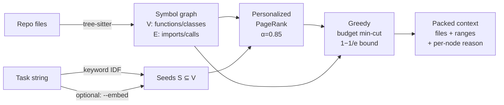

<div align="center">

# `mincut-context`

**Token-minimal context selection for AI coding agents.**

A symbol graph of your repo + personalized PageRank + budget-constrained min-cut
— picks the smallest provably-relevant context for any task.

[](https://www.npmjs.com/package/mincut-context)
[](https://www.npmjs.com/package/mincut-context)
[](https://bundlephobia.com/package/mincut-context)
[](./src)
[](./package.json)
[](./tests)
[](./LICENSE)

</div>

<p align="center"></p>

<div align="center">

```bash
npm install -g mincut-context     #   global CLI: mcx
npx mincut-context pack "fix the login validation bug" --budget 4000
```

</div>

> One sentence: an agent that opens `mincut-context` first gets the minimum cohesive *region* of code its task depends on — not a grep hit, not a whole file, not the whole repo.

---

<details>
<summary><b>Table of contents</b></summary>

- [Why](#why)
- [The idea](#the-idea)
- [Install](#install)
- [Quick start](#quick-start)
- [Use it three ways](#use-it-three-ways) — [MCP server](#1-as-an-mcp-server--recommended-for-agents) · [CLI](#2-as-a-cli) · [Library](#3-as-a-library)
- [How it works](#how-it-works)
- [Real-world examples](#real-world-examples)
- [Languages](#languages)
- [CLI reference](#cli-reference)
- [How it compares](#how-it-compares)
- [Roadmap](#roadmap)
- [Tradeoffs (honest)](#tradeoffs-honest)
- [Contributing](#contributing)
- [License](#license)

</details>

---

## Why

AI coding agents waste your context window. Two failure modes:

| | What it does | Cost |
|---|---|---|
| **Over-stuff** | Dumps whole files / all of `src/` | Burns tokens, drowns the model, hurts answer quality |
| **Under-stuff** | Grep a string, return 3 lines | Misses callers, dependents, tests — model hallucinates |

Neither uses what the code actually *is*: a graph.

## The idea

Treat context selection as a graph problem.

> Given a symbol graph `G = (V, E, w)` where `V` are code units (functions, classes), `E` are dependency edges (imports, calls, references), `w(v)` is the token cost of `v`, a token budget `B`, and seeds `S ⊆ V` derived from the task:
>
> Find `T ⊇ S` with `Σ tokens(T) ≤ B` minimizing the **boundary cut cost** `cut(T, V\T) = Σ w(e)` for edges crossing the boundary.

In plain English: pick a connected, low-token region that has few "loose ends" pointing outside it. The inside of the cut is what the agent needs to see; the outside is safely ignorable.

The objective is **submodular**, so a greedy algorithm gives a `(1 - 1/e) ≈ 0.63` approximation guarantee. Full math in [`SPEC.md`](./SPEC.md).

---

## Install

```bash
# global CLI (recommended)
npm install -g mincut-context

# or per-project
npm install --save-dev mincut-context

# or one-shot, no install
npx mincut-context pack "your task" --budget 4000
```

Requires **Node ≥ 18.17**. TypeScript types ship with the package.

## Quick start

```bash
# 1. Index any repo once (warms the cache)
mcx index .

# 2. Ask for context for a task
mcx pack "fix the login validation bug" --budget 4000

# 3. Pipe straight into your agent
mcx pack "..." --format markdown > context.md
mcx pack "..." --format json | jq '.files[].path'
```

---

## Use it three ways

### 1. As an MCP server — recommended for agents

Drop into Claude Code, Codex, Cursor, or any MCP-aware client:

```json
{
  "mcpServers": {
    "mincut-context": {
      "command": "npx",
      "args": ["-y", "mincut-context", "mcp"]
    }
  }
}
```

Your agent now has three tools:

| Tool | Description |
|---|---|
| `pack_context(task, repo, budget?)` | Get a token-minimal, structurally-relevant context window |
| `expand_node(node, depth?)` | Pull more around a specific symbol |
| `explain_selection()` | The rationale for the last selection |

### 2. As a CLI

```bash
mcx pack "your task description" --budget 4000             # plain output
mcx pack "..." --format json | jq                          # pipe-friendly
mcx pack "..." --format markdown > context.md              # ready-to-paste
mcx pack "..." --interactive                               # Ink TUI to pin / exclude
mcx pack "..." --embed                                     # semantic seeding
mcx index .                                                # warm the parse
mcx mcp                                                    # run as MCP server
```

### 3. As a library

```ts
import { pack } from 'mincut-context';

const result = await pack({
  task: 'fix the login validation bug',
  repo: process.cwd(),
  budget: 4000,
});

for (const f of result.files) {
  console.log(f.path, f.score.toFixed(3), f.tokens, '·', f.reasons[0]);
}
// → src/auth/login.ts        0.541  612 · seed — matched directly by task
// → src/auth/session.ts      0.408  483 · attached (60%)
```

Full TypeScript types — `pack`, `indexRepo`, `SymbolGraph`, `personalizedPageRank`, `greedySelect` are all exported.

---

## How it works



The five steps in pseudocode:

```text
pack(task, repo, budget):
  1. graph  = index(repo)                       # tree-sitter → symbol+edge graph
  2. seeds  = scoreSeeds(task, graph)           # keyword IDF (+ embeddings if --embed)
  3. ranks  = personalizedPageRank(graph, seeds, α=0.85)
  4. T      = greedyMinCut(graph, ranks, seeds, budget):
       T ← seeds
       while Σ tokens(T) < B:
         v* ← argmax_{v ∉ T, attach(v,T) > 0}
                 rank(v) · attach(v,T) / tokens(v)
         T ← T ∪ {v*}
  5. ranges = collapseToFileRanges(T)
  6. return { files: ranges, tokens, graph: {...}, explain }
```

The "no isolated nodes" rule (`attach(v, T) > 0`) is what gives you the *cohesion guarantee* — adding a fully-detached node would strictly increase the cut without benefit, so the greedy refuses. That's why an "auth" task never drags in unrelated UI files even when budget permits.

### Semantic embeddings (optional)

Pure keyword matching misses semantic neighbors:

```bash
$ mcx pack "ranking and centrality algorithm" --repo .
no context selected — no symbols matched

$ mcx pack "ranking and centrality algorithm" --repo . --embed --embed-weight 0.8
→ src/core/graph.ts         0.638  205 tok
→ src/core/pagerank.ts      0.282  725 tok   ← the actual algorithm!
→ src/seeds/keyword.ts      0.080   18 tok
```

"Centrality" never appears in any symbol name — only embeddings could find this.
Uses [`@xenova/transformers`](https://github.com/xenova/transformers.js) (Transformers.js + ONNX). Fully local, ~22 MB model download on first use.

---

## Real-world examples

**On the [Fluent Player](https://fluentplayer.com) free repo** (225 files, 845 symbols, 2,726 edges):

```bash
$ mcx pack "analytics visit tracking" --budget 3000 --exclude tests/**
→ resources/js/utils/googleAnalytics.js   0.553   556 tok   ← seed
→ resources/js/utils/ajax.js              0.174   254 tok
→ resources/js/AnalyticsTracker.js        0.162  1477 tok
→ resources/admin/utils/Notify.js         0.077   104 tok
→ [5 tail files pulled in by graph attachment]
selected 20 / 845 symbols (2.4% of codebase)
```

That's exactly the analytics slice — no UI noise, no test fixtures, no unrelated modules. An agent given this context can reason about analytics changes without the rest of the repo.

---

## Languages

| Language | Status | Notes |
|---|---|---|
| TypeScript / JavaScript | ✅ v1.0 | `.ts .tsx .js .jsx .mjs .cjs` |
| Python | ✅ v1.0 | `.py .pyi`, relative imports, decorators, methods |
| Rust, Go, PHP, Vue SFC, … | community welcome | tree-sitter grammar + symbol queries |

Adding a language is one parser file implementing `LanguageParser` + one line in `parseForExt`. See [`src/parsers/py.ts`](./src/parsers/py.ts) as a template.

---

<details>
<summary><b>CLI reference</b></summary>

```text
Usage: mcx pack [options] <task...>

Pack a token-minimal context window for the given task.

Options:
  -r, --repo <path>               Repository root (default: cwd)
  -b, --budget <tokens>           Token budget (default: 4000)
  -k, --seeds <count>             Top-k seeds (default: 8)
      --alpha <number>            PageRank damping (default: 0.85)
      --include <pattern...>      Restrict to glob patterns (e.g. src/auth/**)
      --exclude <pattern...>      Extra ignore patterns appended to .gitignore
  -f, --format <fmt>              plain | json | markdown
      --no-color                  Disable colored output
      --embed                     Use semantic embeddings (~22 MB model first run)
      --embed-weight <number>     Blend 0..1 (0=keyword, 1=embedding only)
      --embed-model <id>          HF model id (default Xenova/all-MiniLM-L6-v2)
  -i, --interactive               Ink TUI for pin/exclude before output
      --cache                     Use persistent parse cache (.mincut-cache/) — fast repeat runs
      --cache-dir <path>          Override cache directory (absolute path)
      --community-boost <number>  Louvain same-community boost (default 0.5, 0 = disabled)
```

Other commands:

```text
mcx index [path]   warm the parse cache (no output beyond stats)
mcx mcp            run as an MCP server over stdio
mcx --version      print the installed version
```

</details>

---

## How it compares

| Approach | Token-aware | Structural | Semantic | Explainable |
|---|---|---|---|---|
| **Whole file dump** (`cat`, `Read`) | ❌ | ❌ | ❌ | trivially |
| **Grep / ripgrep** | ❌ | ❌ | ❌ | yes |
| **Cursor/Continue RAG** | partial | ❌ | ✅ | hard |
| **AST/symbol graph alone** | ❌ | ✅ | ❌ | yes |
| **`mincut-context`** | ✅ (budget) | ✅ (graph) | ✅ (`--embed`) | per-node `reason` |

---

## Roadmap

- [x] Core: graph + personalized PageRank + greedy min-cut **(v1.0)**
- [x] TS/JS parser **(v1.0)**
- [x] Python parser **(v1.0)**
- [x] CLI (plain / JSON / markdown) **(v1.0)**
- [x] MCP server **(v1.0)**
- [x] Local embeddings (`@xenova/transformers`) **(v1.0)**
- [x] Ink TUI **(v1.0)**
- [x] Persistent on-disk parse cache (incremental reindex) **(v1.1)** — 5.2× warm-run speedup
- [x] Louvain community boost **(v1.1)**
- [ ] Vue SFC / Svelte parsers
- [ ] Rust / Go parsers
- [ ] LSP-backed type-aware call resolution

---

<details>
<summary><b>Tradeoffs (honest)</b></summary>

| What's not optimal | What we do |
|---|---|
| True optimal min-cut is NP-hard | Greedy submodular — `(1−1/e)` bound |
| Tree-sitter symbols are syntactic, not type-aware | Don't follow generics or dynamic dispatch — good for context, not refactoring |
| Embedding model adds ~22 MB on first run | Opt-in behind `--embed` flag |
| Cold start parses whole repo | `.mincut-cache/` per-file cache planned for v1.1 |
| Python class-level constants aren't symbols yet | Only `def` and `class` for now |

</details>

---

## Contributing

```bash
git clone https://github.com/dhrupo/mincut-context.git
cd mincut-context
npm install
npm test           # 116 tests across unit + integration + MCP + CLI + TUI
npm run build
node dist/adapters/cli/bin.js pack "..." --repo /path/to/some-repo
```

PRs especially welcome for:

- **New language parsers** — tree-sitter grammar + symbol queries
- **LSP integration** — type-aware call resolution
- **Cache layer** — persistent `.mincut-cache/`

Each PR must keep the test suite green (`npm test`). New behavior requires tests first (TDD).

## Built with

- [`tree-sitter`](https://tree-sitter.github.io/tree-sitter/) — incremental parsing
- [`graphology`](https://graphology.github.io/) — graph primitives
- [`@xenova/transformers`](https://github.com/xenova/transformers.js) — local ONNX embeddings
- [`@modelcontextprotocol/sdk`](https://github.com/modelcontextprotocol/typescript-sdk) — MCP server
- [`commander`](https://github.com/tj/commander.js) + [`ink`](https://github.com/vadimdemedes/ink) — CLI & TUI
- [`vitest`](https://vitest.dev/) — testing

## License

[MIT](./LICENSE) © [Dhrupo Nil](https://github.com/dhrupo)
